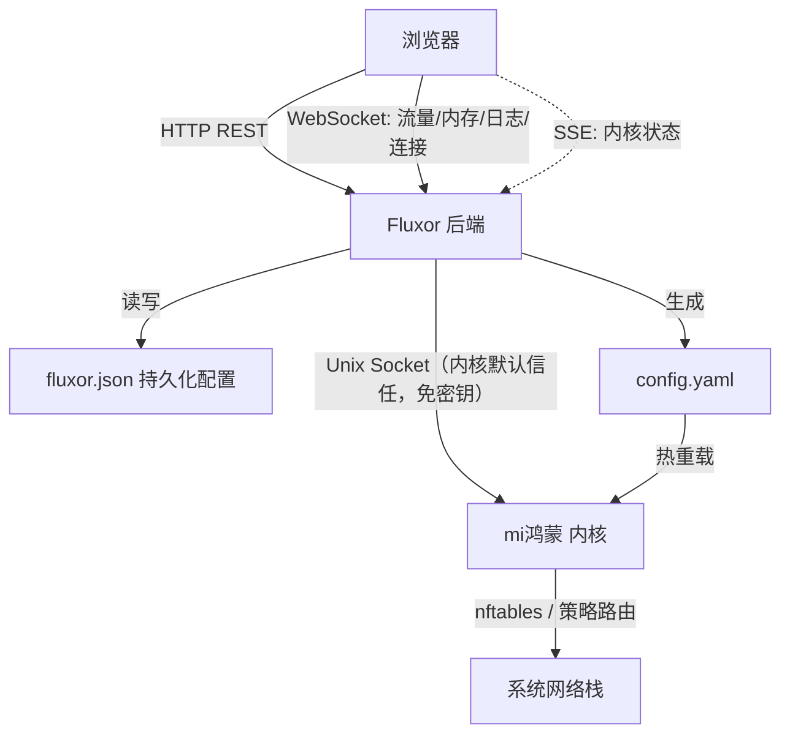
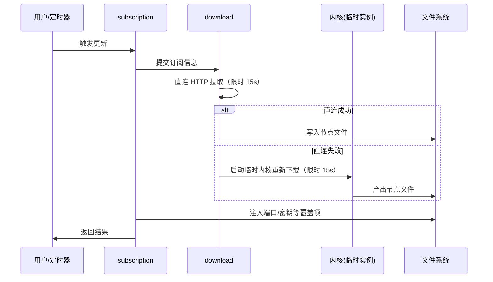

# 架构与设计

本页面向希望了解内部实现的用户，说明 Fluxor 的整体结构、关键技术决策与由此带来的行为特征。

---

## 整体形态

Fluxor 是**前后端不分离**的单体程序：

* **后端**：Go 编写，托管在本地 UNIX Domain Socket 上（默认 `/var/apps/Fluxor/target/app.sock`），负责内核进程生命周期、订阅拉取与配置生成、以及前端与内核之间的全部中转。
* **前端**：Vue 3 + TypeScript 单页应用，构建产物在**编译期**通过 `//go:embed` 内嵌进后端二进制。

因此最终交付物只有一个 `fluxor` 可执行文件。

### 数据流



### 各通道的职责划分

| 通道 | 协议 | 用途 | 说明 |
|------|------|------|------|
| 管理接口 | HTTP | 配置读写、订阅管理、内核启停 | 全部经后端中转，内核侧走 UNIX Socket，**不携带认证头** |
| 实时数据 | WebSocket | 流量速率、内存占用、日志流、连接列表 | 引用计数 + 防抖断开，可重连 |
| 内核状态 | SSE | 运行中 / 已停止 | 接入即快照，变更才推送 |
| 内核版本 | HTTP `/version` | 内核版本号 | **内核原生 API**，不经 SSE 转发 |

> 内核版本之所以独立于 SSE：状态推送通道只承载「状态」，避免夹带会变化的业务数据，也避免后端为了取版本而引入额外的网络 IO 与失败分支。

---

## 目录与关键文件

```text
fluxor/
├── Makefile                   # 统一构建入口
├── backend/
│   ├── main.go                # 入口：参数与环境变量、路由注册、自动启动内核、优雅退出
│   ├── dist/                  # 前端构建产物（构建时同步，参与 go:embed）
│   └── internal/
│       ├── config/            # 全局配置与路径
│       ├── configgen/         # config.yaml 模板渲染
│       ├── configcheck/       # YAML 校验与结构化改写
│       ├── core/              # 内核进程生命周期 + SSE 状态推送
│       ├── tproxy/            # TProxy 防火墙与策略路由
│       ├── subscription/      # 订阅拉取、合并、定时器
│       ├── dashapi/           # 内核 HTTP API 反向代理
│       ├── wsproxy/           # WebSocket 双向桥接
│       ├── netinfo/           # 公网 IP / 归属地 / 网卡
│       ├── delaytest/         # 连通性延迟测试
│       ├── quality/           # 节点质量评分
│       ├── appupdate/         # 版本检查与自更新
│       ├── buildinfo/         # 编译期注入的版本号
│       └── web/               # 页面渲染与 /app-version
└── frontend/
    └── src/
        ├── App.vue            # 外壳：侧边栏、主题、Toast、确认框
        ├── i18n.ts            # 中英文案
        ├── utils/api.ts       # apiFetch / wsConnect / sseConnect
        ├── utils/mock.ts      # 离线开发模拟器（仅 DEV）
        ├── store/             # Pinia 状态
        └── views/             # 各功能页面
```

后端按功能域拆包，依赖方向严格单向（叶子包 → 基础层 → 核心层 → 业务层），禁止循环依赖。

---

## 订阅更新链路

订阅更新是整条链路里最耗时、最容易卡住的操作，因此对超时有明确约定：



约定要点：

1. **各阶段 15 秒上限**，直连与临时内核两条路径合计最坏约 30 秒。
2. **一律不重试**——早期版本为「60 秒 × 3 次重试」，单次更新最长可拖到 3 分钟，已移除。
3. **临时内核进程回收有界**：等待子进程退出的操作带超时，避免因管道被持有而永久阻塞。
4. **尽量不在持锁期间做网络 IO**：先取配置快照，锁外下载，再锁内写回。

---

## 配置文件的并发写入

`fluxor.json` 同时承载**订阅配置**与 **TProxy 旁路字段**，由两个不同的包分别写入。为此约定：

* 所有读写都经**同一把文件锁**；
* 写入一律走「**读—改—写**」，只合并自己负责的键，绝不整文件覆写；
* 否则「保存一次订阅配置」会把 TProxy 的绕过列表静默清空。

---

## 实时数据通道的生命周期

流量、内存、日志、连接四路 WebSocket 采用**引用计数 + 防抖断开**：

```
subscribe()   → 计数 +1 → 首次订阅时建立连接
unsubscribe() → 计数 -1 → 归零后延迟 3 秒 → 仍无订阅才真正断开
```

好处是页面来回切换时连接保持连续、体验平滑，同时页面真正离开后不会留下后台连接。日志流在断开后按指数退避重连（1s → 2s → 4s → … → 上限 30s）。

内核状态 SSE 使用同样的计数与防抖策略；浏览器 `EventSource` 自带重连，因此前端不再叠加握手超时。

---

## 内核进程生命周期

* **自动启动**：面板启动时若检测到内核未运行，会自动拉起。
* **状态判定**：通过 PID 文件 + 校验该 PID 是否确实是内核进程来判断，避免 PID 复用导致的误判。
* **外部结束**：内核若自行退出（崩溃、被 `kill -9`、OOM），等待子进程的协程会清理 PID 文件并**立即推送「已停止」**。
* **退出清理**：面板收到 `SIGINT` / `SIGTERM` 时，会先停止定时器、清理 nftables 规则，再停止内核，避免留下断网残留。

---

## 安全设计

* **默认不暴露公网**：后端默认只监听 UNIX Domain Socket，由 NAS / 网关的反向代理转发；如需 TCP 监听必须显式指定地址。
* **内部链路不携带认证头**：后端与内核之间（HTTP 反向代理 + WebSocket 桥接）走的是 UNIX Socket，内核默认信任该来源——鉴权中间件只对 TCP 外部控制端口校验 `secret`，给内部链路附加 `Bearer` 头不会被校验，属无效代码，已移除。
* **内部链路的安全边界是文件系统权限**：UNIX Socket 的访问控制由 socket 文件（及其父目录）的拥有者与权限决定，因此不要把 socket 放在任何用户都可访问的位置。
* **面板密钥只管 TCP 外部控制端口**：`panel_secret` 写入 `config.yaml` 的 `secret` 字段，保护外置面板（MetaCubeXD / Zashboard）与其它客户端访问内核 TCP 外部控制端口的链路；密钥不下发给浏览器，Fluxor 自身的界面请求一律经后端中转。
* **路径参数校验**：所有会拼进内核 URL 的路径片段都经过校验，拒绝 `..`、编码后的 `%2e` 等穿越写法。
* **防命令注入**：调用 `nft` / `ip` 等系统命令一律使用参数数组形式，不拼接 shell 字符串。
* **前端模拟器不进生产包**：离线 Mock 仅在开发模式下动态加载，生产构建会被整体摇除。

---

## 版本号机制

面板版本号在**编译期**注入后端：

```bash
make V=1.0.0        # 注入 1.0.0
make                # 缺省 1.0.0
make V=dev          # 产出不参与更新判断的调试版本
```

前端不再持有版本常量，而是在运行时经 `GET /app-version` 向后端查询。这样版本号只有一个来源，不会出现「前端显示 1.2、后端实际 1.3」的不一致。

---

## 前端实现要点

以下几条是开发时容易踩坑的地方，一并记录：

* **Tailwind CSS 4 使用 CSS-first 配置**，主题与自定义工具类集中在 `src/index.css`，不要再找 `tailwind.config.js`（已删除）。
* **`class` 样式需注意级联层**：自定义样式写在 `@layer utilities` 之内，否则优先级会反超工具类。
* **暗色模式基于 `data-theme` 属性**，而非 `prefers-color-scheme`，因此「跟随系统」是显式同步 `data-theme` 实现的。
* **页面切换使用 `<KeepAlive>` 缓存**，因此依赖滚动的页面需在 `onActivated` / `onDeactivated` 中冻结与恢复计算，避免后台页面持续渲染。
* **表格/长列表的排序与解析放在 store 中预计算**，组件只读结果，不在模板里做重计算。
